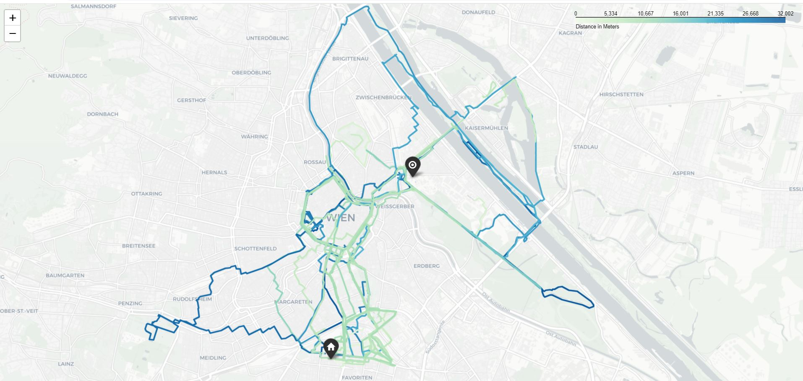
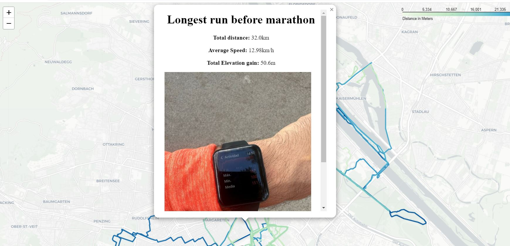

# Exp 1: Visualization of all your Strava Activities on a Map

## How to Run the Experiment

Follow these steps to run the experiment and visualize all your Strava activities on a map:

1. Review the provided code for a better understanding of the process and to adapt it according to your desired coordinates.

2. Run the [main.py](main.py) script using your preferred Python interpreter.

3. After running the script, open the generated map in your web browser. You can find the map at [all_activities_map.html](all_activities_map.html).

## Sample Output Maps

Here are two sample output maps:

### Default Map

### Interactive Map (On Click)

