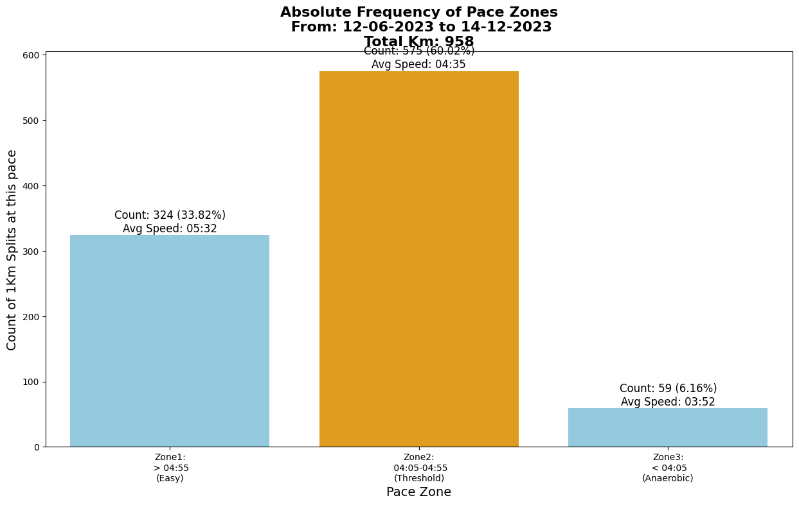

# Exp 2: Extracting 1km splits from all the activities and visualizing them 

This experiment consists on extracting every (complete) km split from your strava activities, storing this information in a curated csv file and visualize them in a barplot, in whcih you observe how many km you have run in some customizable "pace zones". 

An example: all my 1km splits from the last 200 runs I saved in Strava;



## How to Run the Experiment

1. Review the provided code for a better understanding of the process and to adapt it according to your needs.

2. Customize your "pace zones" at [main.py](Exp2VisualizingPacePerKm\main.py).

3. Set an environment variable with your Strava Access Token. You can do this by running the following command in your terminal:

   ```bash
   export ACCESS_TOKEN={YourToken}
   ```

4. Run the [main.py](main.py) script using your preferred Python interpreter. This will generate a [csv](Exp2VisualizingPacePerKm\data\AllTime1kmSplits.csv) file with all your 1km splits. 

5. Run [visualize.py](Exp2VisualizingPacePerKm\visualize.py) to generate your barplot.