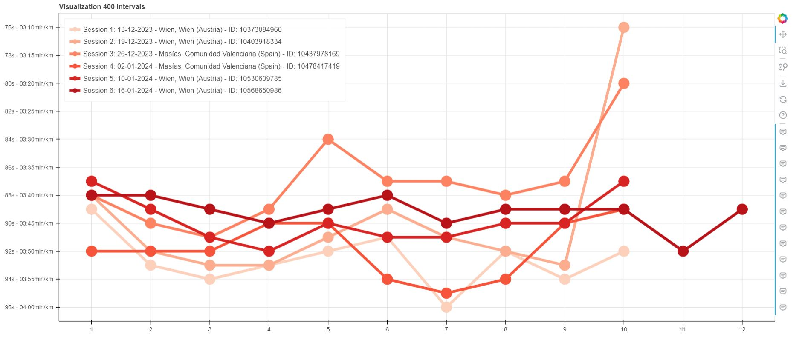

# Exp 3: Visualizing Interval Trainings

This experiment consists on visualizing interval trainings and compare with other identical trainings. Ideally, for Garmin users that upload their activities in Strava. 

An example: all my 400m intervals up to January 2024. 

## How to Run the Experiment

1. Review the provided code for a better understanding of the process and to adapt it according to your needs.

2. Customize your interval length at [main.py](../Exp3VisualizingIntervalTrainings/main.py).

3. Run the [main.py](../Exp3VisualizingIntervalTrainings/main.py) script using your preferred Python interpreter. This will generate a csv file with all your intervals of the chosen length. 

5. Run [visualize.py](../Exp3VisualizingIntervalTrainings/visualize.py) to generate your plot (interval length needs to be provided here too.)