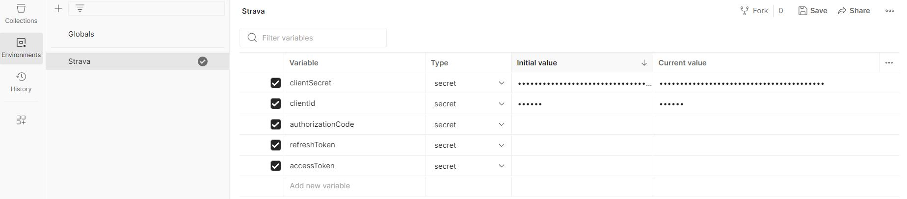
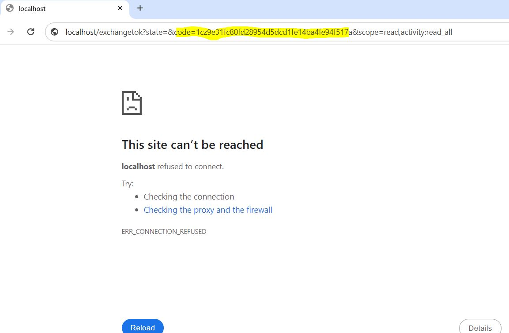
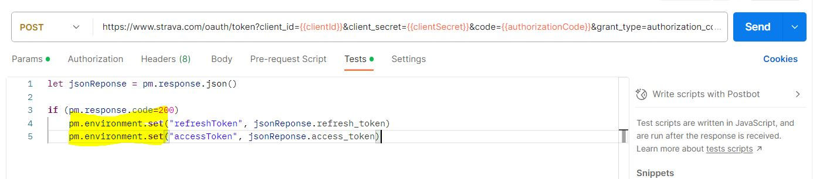

# Strava API Playground


Welcome to my Strava API Playground, where we explore the endless possibilities of the Strava API. Whether you're an enthusiastic runner, cyclist, hiker, or just passionate about Strava, this repository is for you. Discover how to leverage your Strava data, experiment with it, and share your insights and improvements.

## Explore Strava API Experiments

This repository is organized into experiments, each offering a unique insight into your Strava data. To replicate these experiments with your own Strava activities, follow the code and instructions in each folder and run the `main.py` file. Here's what you'll find in each experiment:

- [**Experiment 1: Visualization of All Your Strava Activities on a Map**](..\Exp1VisualizingAllYourActivitiesInMap)
- [**Experiment 2: Visualizing 1000m splits in Barplot with Pace Zones**](..\Exp2VisualizingPacePerKm)
- [**Experiment 3: Visualizing Interval Trainings and Comparing Them Interactively**](..\Exp3VisualizingIntervalTrainings)
- **Experiment 4:** Work in Progress

These experiments showcase just a fraction of what you can achieve with the Strava API. Feel free to extend these projects, create more visualizations, and contribute your improvements via pull requests.

## Getting Started with the Strava API

If you're new to the Strava API, don't worry; it's relatively straightforward. Follow these essential steps to get started:

1. **Register on Strava**: If you're not already registered, [create a Strava account](https://developers.strava.com/docs/getting-started/#account).

2. **Create Your First App**: Follow the instructions to create your first Strava app [here](https://www.strava.com/settings/api). For local experimentation, set the Website and Authorization Callback Domain fields to "localhost."

3. **OAuth Workflow**: The OAuth process may seem a bit challenging, but here are the key steps:

    - Set up environment variables for reusability. Obtain the `ClientId` and `ClientSecret` values from the app you created on Strava.

    

    - Obtain an authorization code with "read_all" permission to make API calls. To do this, copy and paste the following URL into your browser, replacing `{{clientId}}` with your Client ID:

    ```
    https://www.strava.com/oauth/authorize?client_id={{clientId}}&redirect_uri=http://localhost/exchangetok&response_type=code&scope=activity:read_all
    ```

    After authorizing, you'll receive an error in your browser, which is normal. Copy the code from the URL (as shown in the screenshot below):

    

    - And update the environmental variables with the authorization code. In my case, the code was:

    ``` 
    1zc9e31fc80fd28954d5dcd1fe14ba4fe94f517a
    ```

    - Exchange your authorization code for an OAuth access token by sending the following POST request:

    ```
    https://www.strava.com/oauth/token?client_id={{clientId}}&client_secret={{clientSecret}}&code={{authorizationCode}}&grant_type=authorization_code
    ```

    After executing it, copy and paste the generated access and refresh tokens into your environment variables. If you're using Postman, you can automate this in the "Tests" tab:
    
    

    - Since access tokens have a short expiration, configure the request to refresh the token using this POST request:

    ```
    https://www.strava.com/oauth/token?client_id={{clientId}}&client_secret={{clientSecret}}&code={{authorizationCode}}&grant_type=refresh_token&refresh_token={{refreshToken}}
    ```

    As before, automate this process in the "Tests" tab. You will need this if you work during some days in the same project.

## License

This project is open-source, and you are welcome to use it for your own explorations and developments.


## Connect with Me

If you're passionate about running or eager to join my journey as I prepare for my first marathon, there are multiple ways to stay connected and get updates:

- **TikTok**: Follow me on TikTok for fun and insightful videos about running and training. Find inspiration, tips, and join the running community.
  [](https://www.tiktok.com/@guille_alaman)

- **Instagram**: Explore my Instagram for a visual journey through my marathon preparation. Get a behind-the-scenes look at training, races, and the running lifestyle.
  [](https://www.instagram.com/guille_alaman)

- **LinkedIn**: Connect with me on LinkedIn to stay updated on my professional journey, career insights, and networking opportunities.
  [](https://www.linkedin.com/in/guillermo-alam%C3%A1n-requena-57a011180/)

Follow, like, and connect to be a part of my running and professional adventures.
